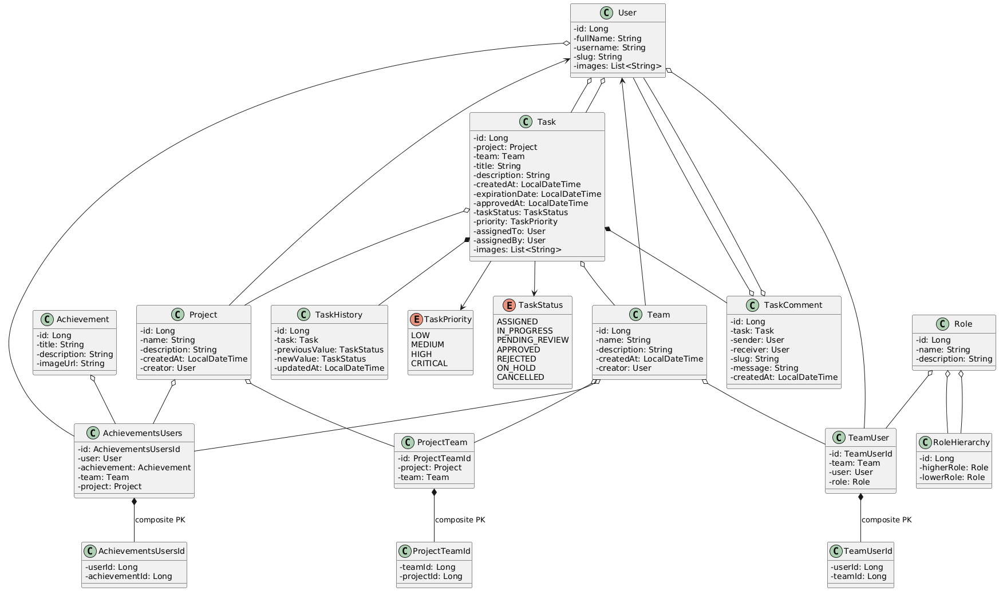

# TaskManager project

The TaskManager application helps you organize tasks for users. It provides endpoints for creating, accessing, and managing tasks.

### Accessing Swagger

You can access the Swagger documentation for all available endpoints by visiting the following URL:

```
http://localhost:8080/swagger-ui/index.html
```

### Diagrams

#### Sequence Diagram


This diagram illustrates the sequence of interactions between components in the application.

#### Component Diagram


The main application communicates with three main components: Redis for caching, PostgreSQL for the database, and MinIO for storage.

#### Class Diagram



The class diagram showcases the main classes in the application: User and Task. Users can have roles, and tasks can include images.

### Environments

To run this application, you need to set up environment variables. Create a `.env` file in the root directory with the following environment variables:

- `SPRING_DATASOURCE_HOST`: Host of the PostgreSQL database.
- `SPRING_DATASOURCE_USERNAME`: Username for the PostgreSQL database.
- `SPRING_DATASOURCE_PASSWORD`: Password for the PostgreSQL database.
- `SPRING_DATASOURCE_DATABASE`: Name of the PostgreSQL database.
- `SPRING_DATASOURCE_SCHEMA`: Name of the PostgreSQL schema.


- `SPRING_DATA_REDIS_HOST`: Host of the Redis instance.
- `SPRING_DATA_REDIS_PORT`: Port of the Redis instance.
- `SPRING_DATA_REDIS_DATABASE`: Database index of the Redis instance.


- `JWT_TOKEN_SECRET`: Secret string for JWT tokens.
- `JWT_TOKEN_EXPIRED`: Expiration time for JWT tokens.


- `MINIO_BUCKET`: Name of the bucket for MinIO.
- `MINIO_URL`: URL of the MinIO instance.
- `MINIO_ACCESS_KEY`: Access key for MinIO.
- `MINIO_SECRET_KEY`: Secret key for MinIO.

Ensure these environment variables are correctly set up before running the application.