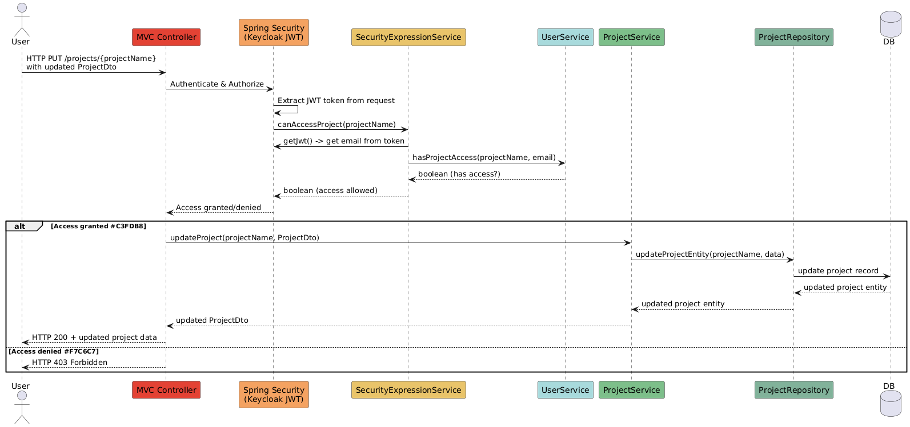

# 🗂️ **TaskManager Application**

The **TaskManager** (`Task_project`) is a Java-based RESTful service that helps users organize and manage tasks through a set of API endpoints. It provides functionality for creating, reading, updating, and deleting tasks, with support for user roles, file attachments, and caching. The project follows best practices in Java and Spring Boot development, making it suitable for production use.

## 📚 **Table of Contents**

- [✨ Features](#features)
- [🛠 Technologies & Tools](#technologies--tools)
- [🔧 Configuration](#configuration)
- [🚀 Usage](#usage)
- [🏗️ Architecture](#architecture)
- [🤝 Contributing](#contributing)

## ✨ **Features**

- **Task Management**: Create, retrieve, update, and delete tasks via RESTful endpoints.
- **Task Comments**: Manage task comments with create, update, delete, and paginated retrieval secured by role-based and ownership access control.
- **User Roles and Permissions**: Role-based access control with fine-grained permission checks enforced via Spring Security expressions.
- **Authentication**: Uses **Keycloak** for OAuth2-based authentication and authorization, replacing custom JWT implementations for robust and centralized security management.
- **File Attachments**: Tasks can include image uploads stored using **MinIO**.
- **Event Streaming**: Integrated with **Apache Kafka** to send events when a task is approved. These events trigger checks for achievement unlocks related to the new task.
- **Logging and Monitoring**: Production-level logging and monitoring using **Promtail** for log collection, **Loki** for log aggregation, **Prometheus** for metrics gathering, and **Grafana** for visualization and alerting dashboards.
- **Swagger API Documentation**: Interactive API docs for all endpoints including tasks and comments.
- **High Performance**: Uses asynchronous I/O and efficient data access with Spring Data JPA and PostgreSQL.
- **Comprehensive Reporting**: Generate secured, filterable, downloadable PDF reports on user task performance, team progress, project status, top performers, and task progress within date ranges.

## 🛠 **Technologies & Tools**

### 🧑‍💻 **Language & Frameworks**
- **Java 17+**: Primary language
- **Spring Boot**: For REST APIs, GraphQL, OAuth2 security, Actuator, and data access (JPA)
- **MapStruct**: Compile-time mapping between DTOs and entities
- **GraphQL**: Query support using Spring Boot GraphQL and `graphql-java-servlet`

### 🔐 **Authentication & Authorization**
- **Keycloak**: OAuth2/OpenID Connect identity provider replacing custom JWT handling
- **Spring Security**: Resource server and client support for secure endpoints

### 💾 **Data & Storage**
- **PostgreSQL**: Primary relational database
- **MinIO**: S3-compatible object storage for task-related file uploads
- **Liquibase**: Database schema versioning and migrations

### 📨 **Event Streaming & Messaging**
- **Apache Kafka**: Used to publish events when tasks are approved, triggering achievement checks

### 📊 **Monitoring, Logging & Observability**
- **Prometheus**: Metrics collection
- **Grafana**: Dashboards and visualizations for application metrics
- **Loki & Promtail**: Centralized logging infrastructure for production-grade observability
- **Micrometer**: Metric instrumentation integrated with Prometheus

### 📘 **API Documentation**
- **SpringDoc + OpenAPI**: Generates and serves Swagger UI for REST endpoints

### 🧰 **Validation & Utilities**
- **Jakarta Validation**: For validating DTOs (JSR 380)
- **Hibernate Validator**: Implementation of Jakarta Bean Validation
- **Slugify**: URL-safe slugs for entity identifiers
- **DataFaker**: Used to generate realistic fake data for testing or seeding
- **JSoup**: HTML parsing and sanitization
- **Flying Saucer**: PDF generation from XHTML documents

### ⚡ **Resilience & Retry**
- **Resilience4j**: Retry, CircuitBreaker, RateLimiter patterns

### 🐳 **Build & Containerization**
- **Gradle**: Project build tool (wrapper included)
- **Docker & Docker Compose**: Multi-container orchestration for services like PostgreSQL, Kafka, Keycloak, Grafana, etc.

### 🧪 **Testing & Dev Tools**
- **JUnit**: Unit and integration testing
- **Testcontainers**: Spinning up PostgreSQL and other services in containers for isolated tests
- **Lombok**: Reduces boilerplate in Java classes
- **Git**: Version control system

## 🔧 **Configuration**

Configuration is managed via environment variables. A `.env.default` file is included as a reference. To run the application, create a `.env` file in the root directory and configure the required values.

> ⚠️ _The system will **fail to start** if any essential environment variable is missing or misconfigured._

---

### 🗃️ **PostgreSQL Database**

- **SPRING_DATASOURCE_HOST**: Database host (e.g., `localhost`)
- **SPRING_DATASOURCE_PORT**: Database port (default: `5432`)
- **SPRING_DATASOURCE_DATABASE**: Name of the database (e.g., `taskdb`)
- **SPRING_DATASOURCE_USERNAME**: DB username
- **SPRING_DATASOURCE_PASSWORD**: DB password
- **SPRING_DATASOURCE_SCHEMA**: (Optional) Schema name (e.g., `task_list`)

---

### 🧵 **Kafka / Zookeeper**

- **BOOTSTRAP_SERVER**: Kafka bootstrap server (e.g., `localhost:29092`)
- **KAFKA_BROKER_ID**: Kafka broker ID
- **KAFKA_ZOOKEEPER_CONNECT**: Zookeeper connection string
- **KAFKA_ADVERTISED_LISTENERS**: Advertised Kafka listeners
- **KAFKA_LISTENER_SECURITY_PROTOCOL_MAP**: Protocol map
- **KAFKA_INTER_BROKER_LISTENER_NAME**: Internal broker listener
- **KAFKA_OFFSETS_TOPIC_REPLICATION_FACTOR**: Replication factor (usually `1` in dev)
- **KAFKA_BROKERCONNECT**: Broker connect string (e.g., `localhost:9092`)
- **ZOOKEEPER_CLIENT_PORT**: Zookeeper port
- **ZOOKEEPER_TICK_TIME**: Zookeeper tick time (e.g., `2000`)

---

### 📂 **MinIO Object Storage**

- **MINIO_URL**: MinIO server URL (e.g., `http://localhost:9000`)
- **MINIO_ACCESS_KEY**: MinIO access key (e.g., `minioadmin`)
- **MINIO_SECRET_KEY**: MinIO secret key (e.g., `minioadmin`)
- **MINIO_BUCKET**: Bucket name (e.g., `images`)

---

### 🔐 **Keycloak Authentication**

- **KEYCLOAK_ADMIN_SERVER_URL**: Admin server URL (e.g., `http://localhost:8081`)
- **KEYCLOAK_ADMIN_REALM**: Admin realm (e.g., `master`)
- **KEYCLOAK_TARGET_REALM**: Application realm (e.g., `task-realm`)
- **KEYCLOAK_ADMIN_CLIENT_ID**: Admin client ID (e.g., `admin-cli`)
- **KEYCLOAK_ADMIN_USERNAME**: Admin username (e.g., `admin`)
- **KEYCLOAK_ADMIN_PASSWORD**: Admin password (e.g., `admin`)
- **KEYCLOAK_CLIENT_ID**: Application client ID
- **KEYCLOAK_CLIENT_SECRET**: Client secret for public clients
- **KEYCLOAK_ISSUER_URI**: Issuer URI for token validation
- **KEYCLOAK_TOKEN_URI**: Token endpoint
- **KEYCLOAK_AUTH_URI**: Authorization endpoint

---

> ✅ _All configuration variables should be placed in a `.env` file and referenced using `env_file` in Docker Compose for consistent environment replication.

## 🚀 Usage

Once the application is running at `http://localhost:8080`, follow these steps to begin using the system.

---

### ✅ Step 1: Initialize Sample Data

Open Swagger UI at: `http://localhost:8080/swagger-ui/index.html#/Data%20Initialization%20Controller/initializeDatabase`

Call the `initializeDatabase` endpoint to populate the system with mock data. This will:

- Create **2 projects**, **2 teams**, and **20 users**
- Assign **100 to 401 tasks** (per user except the admin)
- Add **1 to 5 comments** to each **non-approved task**

⏳ *This process takes approximately **1.5 minutes**. Once complete, you’ll see the message:* "Data initialization completed successfully!"

At this point, **Kafka** will automatically emit events in the background to check for **user achievements** based on task activity.

---

### 🔐 Step 2: Authenticate via Swagger UI

Use **Keycloak OAuth2** to authorize yourself before using secured endpoints:

1. Open: `http://localhost:8080/swagger-ui/index.html`
2. Click the **Authorize** button.
3. Use the following configuration:
  - **Authorization URL**:  
    `http://host.docker.internal:8081/realms/task-realm/protocol/openid-connect/auth`
  - **Token URL**:  
    `http://host.docker.internal:8081/realms/task-realm/protocol/openid-connect/token`
  - **Flow**: `authorizationCode`
4. Enter the credentials:
  - **Username (Email)**: Obtain from `pgAdmin`
  - **Password**: `password` (default for all demo users)

---

### ✅ Step 3: Use the System Features

After authenticating, you can fully use all system features through Swagger UI according to your permissions.

---

## 🏗️ Architecture

- **Sequence Diagram**: Request flow from client → controller → service → repository
  

- **Component Diagram**: Interaction between Spring Boot app, PostgreSQL, MinIO, Keycloak, etc.
  

- **Class Diagram**: Shows core domain classes (`User`, `Task`, etc.) and their relationships (e.g., tasks belong to users, may include attachments)
  

## 🤝 Contributing

We welcome your contributions! Please follow these steps:

1. **Fork** the repository.
2. Create a **feature branch**.
3. Make your changes, ensuring:
  - Consistent code style (Java conventions, Spring idioms).
  - Clear, meaningful commit messages.
  - Usage of **Lombok**, exception handling, and validations where needed.
  - Tests for any new business logic (JUnit or integration tests).
4. Submit a **Pull Request** describing your feature or fix.

### 📌 Contribution Guidelines
- Check for existing issues or open a new one to discuss your proposal.
- Keep the code modular, clean, and testable.
- Follow the project’s directory and package structure (`controller`, `service`, `repository`, `model`, etc.).
- Include documentation updates if your change affects usage or configuration.

> Code reviews are part of the process — expect constructive feedback and iterations.
